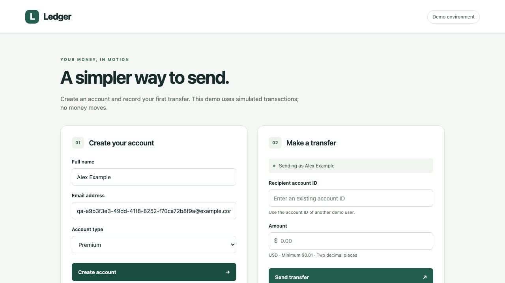

# Verification

**`npm run verify`: 95 passed in 2.9 seconds**, with zero failures, skips, or retries.

Run locally on September 13, 2026 (America/Los_Angeles), after repository cleanup. The saved JSON report starts at `2026-09-14T02:30:07.512Z` and records 2904.824 ms. JSON and JUnit totals were inspected and agree; the HTML report was generated.

| Check | Result |
| --- | --- |
| Strict TypeScript validation | Passed as part of `npm run verify` |
| API suite through real HTTP | 67 passed |
| Chromium browser journeys | 15 passed |
| Configuration and log-redaction checks | 13 passed |
| Managed mock lifecycle | Built and started for the run; verification command completed |
| Failure diagnostics, separate earlier run | Intentional UI failure, nonempty screenshot, and redacted browser API attachment inspected |
| Traces, separate earlier run | Passing browser test included a trace attachment |

The full suite exercised the local Express mock and frontend. Hosted GitHub Actions has not been run. Scope and contract assumptions are in [design decisions](decisions.md).

## Reproduce

After installing dependencies and Chromium:

```sh
npm run verify
npm run test:diagnostics
npm run report
```

HTML is written to `playwright-report/`; JSON/JUnit and attachments to `test-results/`. The diagnostic wrapper validates its deliberately failing test and uses a separate report: `npx playwright show-report diagnostic-report`.

## Failure screenshot example

Captured from the real browser at the deliberate failure after successful registration. It demonstrates artifact capture, not a registration defect.


